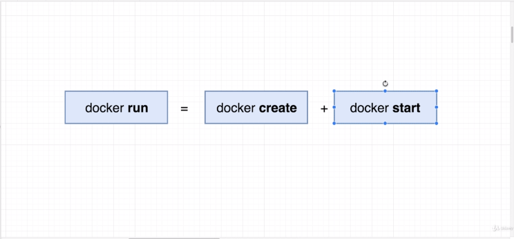
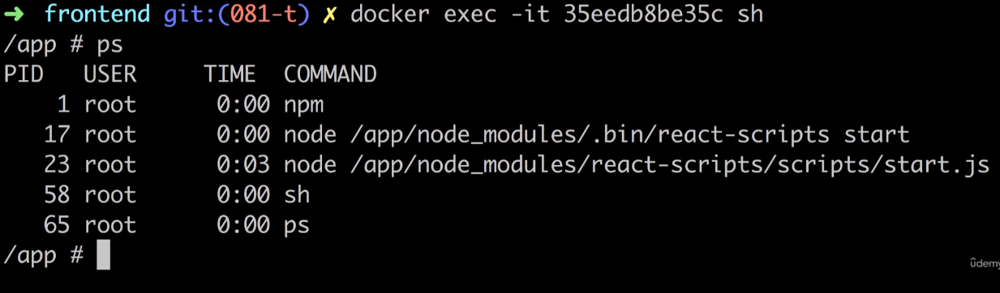
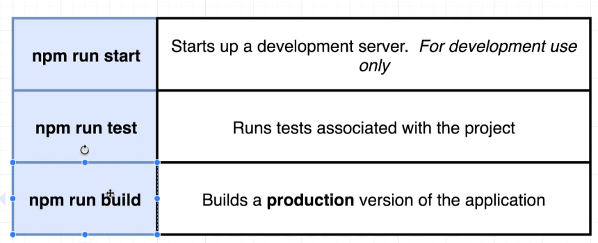

# DOCKER AND KUBERNETES: THE COMPLETE GUIDE [STEPHEN GRIDER]

Build, test, and deploy Docker applications with Kubernetes while learning production-style development workflows

# SECTION 1: Dive Into Docker

## What is Docker?

Docker is a platform or ecosystem around creating and running containers


# Why use Docker?

Docker wants to make it really easy and straight forward for run software or
install in any computer as in webserver as well without worrying about all bunch
of setup or dependencies.


# What is an Image in Docker?

Single file with all the dependencies and config or setup required to run
a very specific program.

for example a NODEJS, NGINX, or REDIS etc


# What is a Container in Docker ?

Is a instance of an Image to runs a program.

It's a program with his own isolated set of hardware resources, it has own set
of memory, it has own space of networking technology, it has own spcae of
hard-drive.

# SECTION 2 - Manipulating Containers with the Docker Client

## 001. Docker Run in Detail


eg:

```
docker run hello-world
```

## 002. Overriding Default Commands


eg:

```
docker run busybox echo hello world!
```

## 003. Listing Running Containers


eg:

```
docker ps

#or

docker ps --all
```

## 004. Container Lifecycle




eg:

```
# create a container

  docker create hello-world

# start a container

  docker start 49f7d23dc867
```

## 005. Restarting Stopped Container

With -a It starts watch for the output of the container and print it out to the terminal

- When you have a container that's already been created, we cannot replace that default command.

eg:

```
docker start -a 49f7d23dc867
```

## 006. Removing Stopped Containers

eg:

```
docker system prune
```

## 007. Retrieving log Outputs


One thing to be really clear about is that by running Docker logs, I'm not rerunning or restarting

the container to in any way, shape or form.

eg:

```bash
docker logs 4b263884282

#It  will follow the logs a live
docker logs --follow cba4cee543f7
```

## 008. Stopping Containers

stop command use to take more time for shutdown the container.

kill command use to shutdown the container immediately.


## 009. Multi-command Containers

we have two separate containers. we want to include redis-cli container into
redis-server container to run together


## 010. Executing Command in Running Containers


eg:

```
docker exec -it 4b263884282 redis-cli
```

## 011. The Purpose of the IT flag

When you running docker on your computer or machine every single container you
are running is running inside a virtual machine running Linux.


The IT flag is two separate flag

```
-it

# or

-i -t

 -i, --interactive          Keep STDIN open even if not attached
 -t, --tty                  Allocate a pseudo-TTY | make sure all the text nicely format | auto-complete
```

## 012. Getting a Command Prompt in a Container

You will not want to execute without having execute same command.

"sh" is a command processor or a shell its allow to type command in and will be
execute inside the container.


eg:

```
docker exec -it 4b263884282 sh
```

## 013. Starting with a Shell


## 014. Container Isolation

The containers do not automatically share their files system even if you access sh from the same image it will create another container instance


# SECTION 3 - Building Custom Images Through Docker Server

## 015. Creating Docker Images


## 016. Building a Dockerfile

[redis-image Dockerfile](./redis-image/Dockerfile)

## 017. Dockerfile Teardown


## 018. What's a Base Image


## 019. The Build Process in Details

why use new command?

```
docker build .
```

the build command it's will be use to take docker file and generating it


## 020. A Brief Recap


## 021. Rebuild with Cache


## 022. Tagging an Image


the convention to tagging an Image


eg:

```
docker build -t localhost/redis:latest .

# and run

docker run localhost/redis
```

## 023. Manual Image Generation with Docker Commit

In common, we use image to create container. We can manually create a container
runs command inside container and generate an image. In straight word we can do
manually the same thing Dockerfile does.


eg:

```
# IMPORTANT YOU DON'T WANT USE THIS WAY IN GENERAL
# BETTER USE Dockerfile APPROACH

docker commit -c 'CMD["redis-server"]' 4b263884282
```

# SECTION 4 - Making Real Projects with Docker

## 024. Making Real Projects with Docker

[simple-web](./simple-web/)

## 025. Base Image Issues


To solve the issue "npm not available on a base image"

```
#Dockerfile
FROM node:alpine
```

alpine is a term in docker role for a small and compact images. Many popular
repositories were going to offer alpine version of their images.

## 027. A few Missing Files

None of the files inside your root directory are available inside the container by
default. Completely segmented out unless you specifically allowed inside your
Dockerfile.


To solve 'no such file or directory'


eg:

```
#Dockerfile
# Install some dependencies

COPY ./ ./

#Default command
.....
```

## 028. Container Port Mapping


We do not setup port-porting inside Dockerfile, a port-porting stuff is strictly
a run time constrain, in other words its something we only change when we run
a container or start a container.


eg:

```
docker run -p 8080:8080 localhost/simpleweb
```

## 029. Specifying a Working Directory


eg:

```
# Dockerfile

WORKDIR /usr/app
```

to check the working directory is no longer in image root directory we can check by

eg:

```
#open 1st cli
docker run -p 5001:5001 <initial-name>/<initial-docker-container>

#open 2nd cli to check
docker exec -it <id-container> sh
```

## 030. Unnecessary Rebuilds

how to avoid having completely reinstall all dependencies just because we made
a change in source code file?

eg:

```
#Dockerfile

COPY ./package.json ./    #just copying current specify directory to WORKDIR directory
RUN npm install           # just run once

COPY ./ ./                # copy over everything else except package.json
```

# SECTION 5 - Docker Compose with Multiple Local Containers

## 031. Introducing Docker Compose


## 032. Docker Compose Files


## 033. Networking with Docker


```
#docker-compose.yml
services:
  redis-server:     # 1st image
    image: 'redis'
  node-app:         # 2nd image
    ...
    ...
    ...

## app.js
const client = redis.createClient({
  // add docker images
  host: 'redis-server',
  // default redis-server
  port: 6379                # specify port for redis-server
});
```

## 034. Docker Compose Command


## 035. Stopping Docker Compose Containers


## 036. Container Maintenance with Compose


```
#docker-compose.yml

version: '3'
services:
  redis-server:
    image: 'redis'
  node-app:
    restart: always       # Restart Policies
    build: .
    ports:
      - "5001:5001"
```

## 037. Container Status with Docker Compose

eg:

```
#in cli with folder related docker-compose.yml
docker-compose ps
```

# SECTION 6 - Creating a Production-Grade Workflow

## 038. Development Workflow


## 039 flow Specifics


## 040. Docker Purpose


## 041. Creating the Dev Dockerfile

eg:

```
#create Dockerfile.dev in root folder directory

#run in cli
docker build -f Dockerfile.dev -t "<images-name>/<container-name>:latest" .    # -f is stand for looking a specify Dockerfile
```

## 042. Duplicating Dependencies


to solve this problem, just delete **node_modules** on root folder.

```
.
├── node_modules    # Delete this for avoid duplicate files in images
├── public
└── src
```

## 043. Docker Volumes


```
-v $(pwd):/app

-v        # volume list | Bind mount a volume
$(pwd)    # pwd stand of "present working directory"
:/app     # when we use a ":" we want to map out a folder inside the container to the folder outside container

-v /app/node_modules  # just a placeholder for the folder that's inside the container
```

## 044. Shorthand with Docker Compose


## 045. Live Updating Tests

```
# open 1st cli
docker-compose up   # to build an image

# open 2nd cli
docker ps   # to copy the run CONTAINER-ID

docker exec -it <container-id> npm run test
```

## 046. Docker Compose for Running Tests

```
# docker-compose.yml
# add this code
version "3"
  services:
  ....
  ....
  ....
  # for test purpose
  test:
    build:
      context: .
      dockerfile: Dockerfile.dev
    volumes:
      - /app/node_modules
      - .:/app
    # override command to run test
    command: ["npm", "run", "test"]

# run cli
docker-compose up --build

```

# 046.1 Docker Attach

```
docker attach <container_id>
```

Attaching to test container. It Only attach to the first process! As you can see in the follow images




## 047. Multi-Step Docker Build for Production environment


but we have an issue here,


so we make two different images to solve this issue.


## 048. Implementing Mutli-Step build

[Dockerfile for production env](./frontend/Dockerfile)

## 049. Running Nginx


# SECTION 6 - Continuous Integration and Deployment with AWS

## 091. Services overview

We will setup this three steps to build our app and delivery it




## 092. Setup Github

You should create a public repository in Guthub and clone it to your local. You can see my project repository here https://github.com/ThalesRocha/docker-react

## 093. Setup Travis CI

The people use Travis to test and deployment.


- You need to sign-up in https://app.travis-ci.com/signin You can use github.
- Login into Travis-CI, authorize Github integration.
- Search docker-react repository, then enable it

## 094. Travis YML File configuration

NOTE: We will run the tests using Dockerfile.dev because this file has all dependencies required for it.


```
language: generic
sudo: required
services:
  - docker

before_install:
  - docker build -t thalesrocha/docker-react -f Dockerfile.dev .

script:
  - docker run -e CI=true USERNAME/docker-react npm run test
```

## 096. Travis YML File configuration

```yml
language: generic
sudo: required
services:
  - docker

before_install:
  - docker build -t thalesrocha/docker-react -f Dockerfile.dev .

script:
  - docker run -e CI=true thalesrocha/docker-react npm run test -- --coverage
```

NOTE: We should add `-- --coverage` to the end of the `npm` command to avoid that terminal stands waiting for an answer

## 097. Automatic build creation

After commit and push your code to remote `travis` should run the tests.

```shell
git add .
git commit -m "added travis file"
git push
```


## 099. AWS Elastic Beanstalk

Log into AWS -> Search for Elastic Beanstalk -> Create Application -> Fill Application Name || Description and Platform as showed right below -> Create.


## 100 More on Elastic Beanstalk

As soon the traffic reach some threshold ELB will auto-scale for us.


## 101 Travis config for deployment

To setup deployment through travis, we should put some information in .travis.yml.

We can found the elastic Beanstalk url through the AWS console.


## 103 Automated deployments

Now we will need to setup the credentials to allow travis deploy our code to AWS. We can do this trough AWS console-> IAM -> Add user.


I can't found the same permission they describe in the video, then I select this one which should work. I think in recent versions aws IAM changes a little bit.


Now we have the AWS_ACCESS_KEY and AWS_SECRET_KEY it's good to store them in a secure way. This could be reached through travisci environment variables. We need to access travis -> settings and add both information, then we can use some placeholder to tell travis ci how to get the credentials.


Then in .travis.yml we should add:

```yml
language: generic
sudo: required
services:
  - docker

before_install:
  - docker build -t thalesrocha/docker-react -f Dockerfile.dev .

script:
  - docker run -e CI=true thalesrocha/docker-react npm run test -- --coverage

deploy:
  provider: elasticbeanstalk
  region: "us-west-2"
  app: "docker"
  env: "Docker-env"
  bucket_name: "elasticbeanstalk-us-west-2-985796569215"
  bucket_path: "docker"
  on:
    branch: master
  access_key_id: $AWS_ACCESS_KEY
  secret_access_key:
    secure: "$AWS_SECRET_KEY"
```
